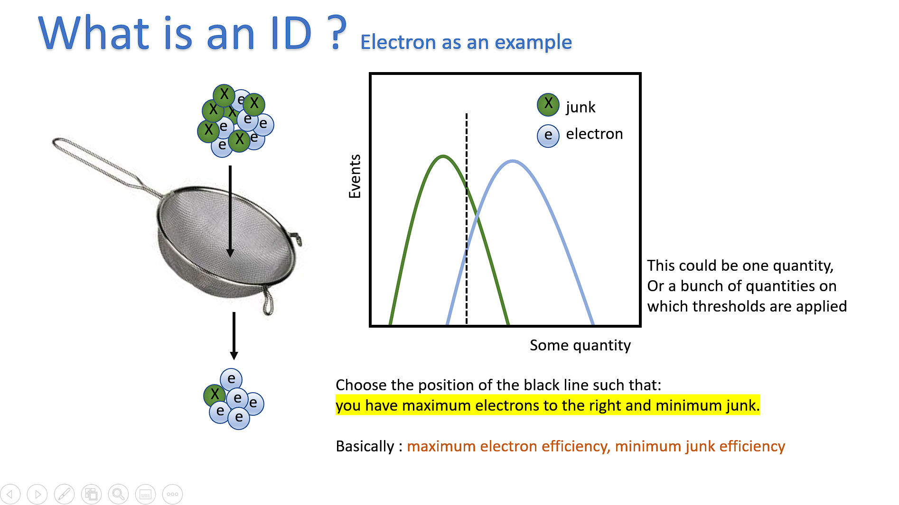

# ID-Trainer

> A simple config-based tool for high-energy-physics machine learning tasks.

Full documentation available here: https://akapoorcern.github.io/ID-Trainer/

|Currently supports||
|:---|---|
|**Binary-classification** (currently using XGBoost and DNN) |Examples: DY vs ttbar, DY prompt vs DY fake, good electrons vs bad electrons|
|**Multi-sample classification** (currently using XGBoost and DNN) |Examples: DY vs (ttbar and QCD)|
|**Multi-class classification** (currently using XGBoost and DNN) |Examples: DY vs ttbar vs QCD, , good photons vs bad photons|

|**Salient features:**|
|---|
|Parallel reading of root files (using DASK)|
|Runs on flat ntuples (even NanoAODs) out of the box|
|Adding multiple MVAs is very trivial (Subject to available computing power)|
|Cross-section and pt-eta reweighting can be handled together|
|Multi-Sample training possible|
|Multi-Class training possible|
|Ability to customize thresholds|

|**What will be the output of the trainer:**|
|---|
|Feature distributions|
|Statistics in training and testing|
|ROCs, loss plots, MVA scores|
|Confusion Matrices|
|Correlation plots|
|Trained models (h5 for DNN / pkl for XGBoost)|

#### Optional outputs

1) Threshold values of scores for chosen working points
2) Efficiency vs pT and Efficiency vs eta plots for all classes
3) Reweighting plots for pT and eta
4) Comparison of new ID performance with benchmark ID flags

# Primary intended use: For ID Training

